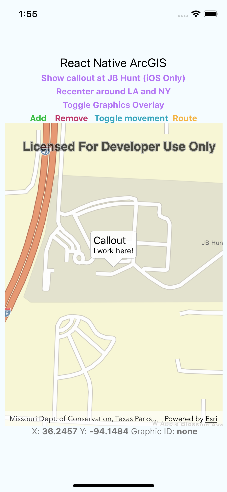
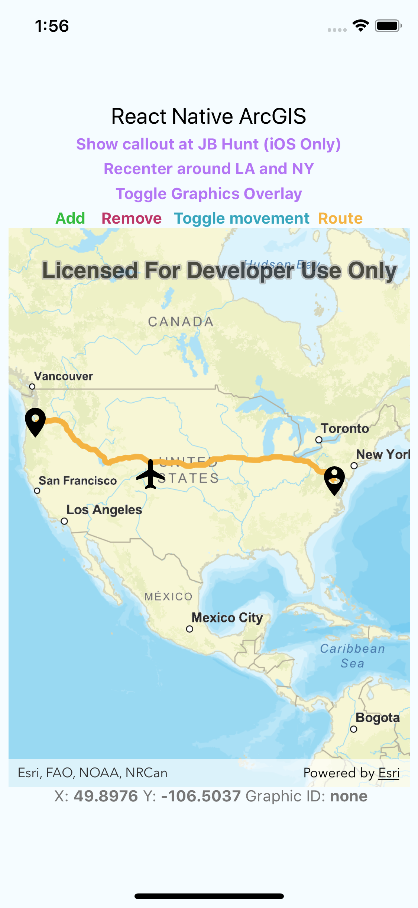

# React Native ArcGIS MapView
A basic port of ArcGIS for React Native. Handles basemap URLs, map recentering, Callout views (iOS only for now), drawing/moving/updating graphics onto the map, routing, and single tap listeners.

 |  | 
----- | ----- | -----

# Usage
```javascript
import ArcGISMapView from 'react-native-arcgis-mapview'
...
render() {
 return(
 ...
        <ArcGISMapView ref={mapView => this.mapView = mapView}
        // your props here
        />
 )
}
...
```

# Table of Contents
* [Installation Instructions](#installation-instructions)
  * [React](#install-the-package-and-link-it)
  * [Android](#modify-your-android-native-project)
  * [iOS](#modify-your-ios-native-project)
  * [License your map](#license-your-map)
* [Props, Callbacks, and Method Calls](#props-callbacks-and-method-calls)
  * [Props](#props)
  * [Props In Depth](#props-in-depth)
    * [Basemap URL](#basemap-url)
    * [onSingleTap](#onSingleTap)
  * [Callbacks](#callbacks)
  * [Methods](#methods)
    * [The Point Object](#the-point-object)
    * [The Image Object](#the-image-object)
    * [Example Overlay Object](#example-overlay-object)
    * [Routing](#routing)
* [License](#license)

# Installation Instructions
### Install the package and link it
`yarn install react-native-arcgis-mapview` or `npm install react-native-arcgis-mapview`

Then run `react-native link react-native-arcgis-mapview`

### Modify your Android native project
First off, make sure your minSdk version is 19 and your targetSdk is at least 28 (ArcGIS requires a minimum SDK level of 19). You can easily set these by modifying your Project build.gradle, within buildscript -> ext. 

Inside your Project Gradle file, inside of allProjects, and within the repositories tag, add the following:
```
maven {
  url 'https://esri.bintray.com/arcgis'
}
```
Then, inside your App Gradle file, if your app does not already have Java 8 Support (ArcGIS Requires this from 100.4 onwards), add the following line inside the android bracket:
```
    compileOptions {
        sourceCompatibility 1.8
        targetCompatibility 1.8
    }
```
That's it. Your project should build.

### Modify your iOS native project
iOS is a bit trickier. Create a podfile in your iOS directory with the following contents:
```ruby
platform :ios, '11.0'

target 'Example' do
  # Uncomment the next line if you're using Swift or would like to use dynamic frameworks
  # use_frameworks!

    rn_path = '../node_modules/react-native'

  # See http://facebook.github.io/react-native/docs/integration-with-existing-apps.html#configuring-cocoapods-dependencies
  pod 'yoga', path: "#{rn_path}/ReactCommon/yoga/yoga.podspec"
  pod 'React', path: rn_path, subspecs: [
    'Core',
    'CxxBridge',
    'DevSupport',
    'RCTActionSheet',
    'RCTAnimation',
    'RCTGeolocation',
    'RCTImage',
    'RCTLinkingIOS',
    'RCTNetwork',
    'RCTSettings',
    'RCTText',
    'RCTVibration',
    'RCTWebSocket',
  ], :modular_headers => true

  # React Native third party dependencies podspecs
  pod 'DoubleConversion', :podspec => "#{rn_path}/third-party-podspecs/DoubleConversion.podspec"
  pod 'glog', :podspec => "#{rn_path}/third-party-podspecs/glog.podspec"

  # If you are using React Native <0.54, you will get the following error:
  # "The name of the given podspec `GLog` doesn't match the expected one `glog`"
  # Use the following line instead:
  #pod 'GLog', :podspec => "#{rn_path}/third-party-podspecs/GLog.podspec"
  pod 'Folly', :podspec => "#{rn_path}/third-party-podspecs/Folly.podspec"
  pod 'RNArcGISMapView', :path => "../node_modules/react-native-arcgis-mapview/ios"

end

# The following is needed to ensure the "archive" step works in XCode.
# It removes React from the Pods project, as it is already included in the main project.
post_install do |installer|
  installer.pods_project.targets.each do |target|
    if target.name == "React"
      target.remove_from_project
    end
  end
end
```
If you already have a podfile, this is the key line you need to add:
`pod 'RNArcGISMapView', :path => "../node_modules/react-native-arcgis-mapview/ios"`

If you don't have swift implemented into your project, open your project directory and make a new Swift file. Name it whatever you want, it doesn't matter. Upon making this file, XCode should ask if you want to create a bridging header. If you plan on using Swift in your project, selecte 'Create Header'; otherwise, select no thanks. Then, open your project file and ensure your iOS Project targets iOS 11 or above and the Swift Language Version is set to 'Swift 4.2.' Clean, rebuild, and you should be good to go.

### License your map
A license is not required to develop and test. However, to release your app, you must provide a license. See [here for iOS](https://developers.arcgis.com/ios/latest/swift/guide/license-your-app.htm) or [here for Android](https://developers.arcgis.com/android/latest/guide/license-your-app.htm) for more information on how to get a license.

Once you have one, it's easy to add it into your project. In your App.js (or wherever you initialize your app)
```javascript
import { setLicenseKey } from 'react-native-arcgis-mapview';

export default class App extends Component {
  ...
  constructor(props){
    setLicenseKey('your_key');
    ...
  }
  ...
}
```
# Props, Callbacks, and Method Calls
### Props
Prop Name | Type | Description | Default
------ | ------ | ------ | ------
initialMapCenter | Object Array | Specifies the initial center of the map. Objects within the array must have both a latitude and longitude values. Including a single point will center around that point, while including multiple points will center around a polygon containing those points. | `[{latitude: 36.244797, longitude: -94.148060}]`
recenterIfGraphicTapped | Boolean | If true, the map will recenter if a graphic is tapped on. | false
basemapUrl | String | A URL that links to an ArcGIS Online map with your style. A description on how to get this working can be found below. [Here's an example of one that works.](https://david-galindo.maps.arcgis.com/home/item.html?id=96b0b60f091d4b3983f23fab131e8a72) | ''
routeUrl | String | A URL that refers to an ArcGIS routing service. See [routing](#routing) below for more information.
minZoom | Double | A value that represents the minimum level in which a user can zoom out. For example, 70000000 is about continent level zoom. | 0
maxZoom | Double | A value that represents the maximum level in which a user can zoom in. For example, 10000 is about building level zoom. | 0
rotateEnabled | Boolean | If false, prevents the user from rotating the map. | true

### Props In Depth
##### Basemap URL
Just follow these steps to get your basemap up and running.
1. To get a basemap URL, I suggest you visit [this link](https://developers.arcgis.com/vector-tile-style-editor/) to style a map to your liking. Once you're done, save your map (bottom left).
2. Now go to [ArcGIS Online](https://www.arcgis.com/home/index.html). Sign in, if necessary, and then click on 'My Content.' Click on your style and you should see a summary page. Next to the bright blue button that says 'Open in Map Viewer,' click on the navigation arrow and then click 'add to new map.' A map should show up with your style. 
3. On the left, under the 'Contents' heading, click the three blue dots under your style and then click 'move to basemap.' If there are other items that are not your basemap, click the three blue dots next to them and click 'Remove.' Once your map style is the only one that's left, click the 'Save -> Save As' floppy icon on top, name your map, click save again, and return to your content.
4. Click on your map object. Click on Share and make sure you check 'Everyone' and then click 'Save.' Click 'Update' if necessary. Then click on the 'Settings' tab, scroll down to the Web Map Section, and then click 'Update Layers to HTTPS,' then 'Update Layers.'
5. Now copy the URL from the search bar (it should look like this: http://david-galindo.maps.arcgis.com/home/item.html?id=fc75f65db9504175b2fb0e87b66672e5#overview), remove anything after the # (including the #), change the http to https, and bingo, you got your basemap URL! Add that as the basemapUrl prop and you're good to go. It might take a moment to get up and running.

#### Callbacks

Callback Name | Parameters | Description
--- | --- | ---
onSingleTap | `{ points: { mapPoint: {latitude: Number, longitude: Number}, screenPoint: {x: Number, y: Number}, },graphicReferenceId: String?, }` | A callback that runs whenever the map is tapped once. A graphics ID is returned if a graphic was tapped on.
onOverlayWasAdded | `{ referenceId: String }` | Called when overlay is added.
onOverlayWasRemoved | `{ referenceId: String }` | Called when overlay is removed.
onOverlayWasModified | `{ referenceId: String, action: String, success: Boolean, errorMessage: String? }` | Fires when an overlay was modified. 
onMapDidLoad | `{ success: Boolean, errorMessage: String? }` | Executed when the map finishes loading or runs into an error.
onRoutingStatusUpdate | `isRouting: Boolean` | Returns true or false whenever the app begins or ends a routing call. Useful for telling the user when a routing action is happening in the background.


#### Methods

Method Name | Parameters | Description
----- | ----- | -----
showCallout | `{ point: {latitude, longitude} , title: String?, text String?, shouldRecenter: Boolean? }` | (iOS Only) Creates a callout popup with a title and description at the given point.
recenterMap | `[ point: {latitude, longitude}, point, ... ]` | Recenters the map around the given point(s).
addGraphicsOverlay | `{pointGraphics: [graphicId: String, graphic: Image]?, referenceId: String, points: [Point] }` | Adds a graphics overlay with the given points. See below for more information.
removeGraphicsOverlay | `{ overlayId: String }` | Removes the graphics overlay with the given ID.
addPointsToOverlay | `{ overlayReferenceId: String, points: [Point] }` | Adds points to the overlay with the given overlayReferenceId.
removePointsFromOverlay | `{ overlayReferenceId: String, referenceIds: [String] }` | Removes points from the overlay with the given overlayReferenceID. The reference ID array are the IDs of the points you wish to remove.
updatePointsOnOverlay | `{ overlayReferenceId: String, updates: [Point], animated: Boolean }` | Updates points on a given overlay. All properties within an individual Point object are optional, though latitude and longitude must both be provided if you are updating either one. Animated controls whether or not the app should animate the transition from one point/rotation to another. Make sure each update is spaced about 500ms apart.
routeGraphicsOverlay | `{ overlayReferenceId: String, excludeGraphics: [String]?, routeColor: String? }` | Routes a one-way route from all points within the overlay associated with the overlayReferenceId. You can exclude points by ID by placing their IDs inside the excludeGraphics array. See below for more info.
getRouteIsVisible | ` {callback: Callback(Boolean)} ` | Returns the visibility of the route layer and passes it through a callback.
setRouteIsVisible | `{ routeIsVisible: Boolean }` | Toggles the visiblity of the routing layer. 
##### The Point Object
Above, the Point object was referenced as 'Point.' The Point object is structured as follows:
```javascript
point: {
  latitude: Number,
  longitude: Number,
  rotation: Number? = 0,
  referenceId: String,
  graphicId: String?,
}
```

##### The Image Object
When defining graphics, use the following format:
```javascript
import { Image } from 'react-native';
...
pointGraphics: [
  {graphicId: 'graphicId', graphic: Image.resolveAssetSource(require('path_to_your_local_image')) },
  // Repeat for as many graphics as you'd like
]
...
```

##### Example overlay object
```javascript
{
    pointGraphics: [
    {graphicId: 'normalPoint', graphic: Image.resolveAssetSource(require('./src/normalpoint.png'))},
    {graphicId: 'personPoint', graphic: Image.resolveAssetSource(require('./src/personpoint.png'))},
    {graphicId: 'planePoint', graphic: Image.resolveAssetSource(require('./src/planepoint.png'))},
  ],
    referenceId: 'graphicsOverlay',
    points: [{
      latitude: 45.512230,
      longitude: -122.658722,
      rotation: 0,
      referenceId: 'Portland',
      graphicId: 'normalPoint',
    },{
      latitude: 38.907192,
      longitude: -77.036873,
      rotation: 0,
      referenceId: 'Washington, D.C.',
      graphicId: 'personPoint',
    },{
      latitude: 39.739235,
      longitude: -104.990250,
      rotation: 0,
      referenceId: 'movingImage',
      graphicId: 'planePoint',
    },
  ]
}
```

##### Routing
For routing to work, you must also pass in a routeUrl prop with a reference to a routing service. Check the [Choosing a routing data source](https://developers.arcgis.com/android/latest/guide/find-a-route.htm) section of this Esri Article for information on how to make one. 

Once you have a routing URL, try calling `routeGraphicsOverlay` to see if your routing service has been configuired correctly. If it doesn't work, chances are your URL doesn't have the necessary permissions set. Make sure it has public access. Note that routing is an asynchronous task, and for longer routes, this may take a moment. Use the `onRoutingStatusUpdate` callback to create any UI you may need to inform the user that a route calculation is currently taking place.

The biggest gotcha, however, is that routing uses up [ArcGIS Online Credits](https://www.esri.com/en-us/arcgis/products/arcgis-online/pricing/credits). You are given 50 free credits a month; however, you must buy additional credits to continue routing. Make sure your ArcGIS Online account has sufficient credits before release.

# License
Library Copyright 2019 David Galindo

Permission is hereby granted, free of charge, to any person obtaining a copy of this software and associated documentation files (the "Software"), to deal in the Software without restriction, including without limitation the rights to use, copy, modify, merge, publish, distribute, sublicense, and/or sell copies of the Software, and to permit persons to whom the Software is furnished to do so, subject to the following conditions:

The above copyright notice and this permission notice shall be included in all copies or substantial portions of the Software.

THE SOFTWARE IS PROVIDED "AS IS", WITHOUT WARRANTY OF ANY KIND, EXPRESS OR IMPLIED, INCLUDING BUT NOT LIMITED TO THE WARRANTIES OF MERCHANTABILITY, FITNESS FOR A PARTICULAR PURPOSE AND NONINFRINGEMENT. IN NO EVENT SHALL THE AUTHORS OR COPYRIGHT HOLDERS BE LIABLE FOR ANY CLAIM, DAMAGES OR OTHER LIABILITY, WHETHER IN AN ACTION OF CONTRACT, TORT OR OTHERWISE, ARISING FROM, OUT OF OR IN CONNECTION WITH THE SOFTWARE OR THE USE OR OTHER DEALINGS IN THE SOFTWARE.

ArcGIS SDK for Android and iOS Copyright 2019 [Esri.](https://developers.arcgis.com/) 
